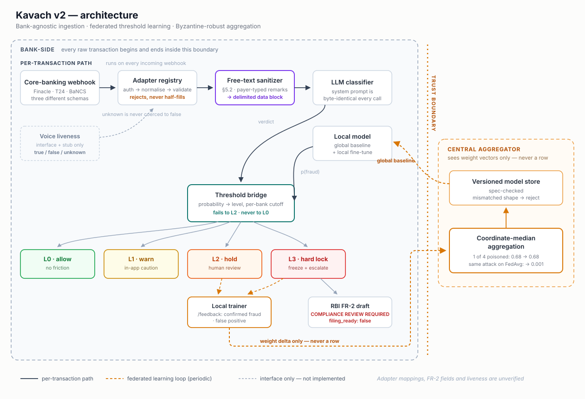

# Kavach v2

**A bank-agnostic fraud-intelligence layer that learns risk thresholds across banks without any bank sharing its data — with the evaluation that says exactly how far that claim has been tested.**

[](LICENSE)
[](#quick-start)
[](#tier-1--unit-and-contract-tests)
[](#status)

Three findings, measured on a public card-fraud dataset partitioned into five synthetic banks:

- **Federation's cold-start advantage comes from positive-class scarcity, not sample scarcity.** A local model with 500 transactions and zero fraud labels scores 0.01 AUC-PR; one fraud label lifts it to 0.5–0.7. Where local history has fraud rows (n=5000), federation still wins — by +0.06 to +0.10, not by the 0.7 the zero-history numbers suggest. [→](#finding-1--federation-fixes-positive-class-scarcity)
- **One malicious participant collapses FedAvg from 0.68 to 0.001 AUC-PR; coordinate-median holds at 0.69** — and local fine-tuning on 5,000 rows recovers 0% of the loss. [→](#finding-2--one-attacker-destroys-fedavg-the-median-holds)
- **Per-bank calibrated thresholds buy alert-budget adherence, not detection.** A single global cutoff sends 3.1% of one bank's traffic to review and 0.4% of another's against the same 1% budget; per-bank cutoffs hold every bank at 0.86–1.14% — while catching the same number of frauds. [→](#finding-3--per-bank-thresholds-buy-budget-adherence-not-detection)

<a id="status"></a>
> **Status — research prototype.** Not validated on Indian UPI/IMPS data (no such labelled dataset was
> available); every result below is measured on European card-present fraud and validates *pipeline
> mechanics*, not fraud detection in the target domain. The bank adapters, regulatory template and
> voice-liveness interface are illustrative and unverified against real APIs. **Not for production
> decisions.** [Full list of what is not verified →](#what-is-explicitly-not-verified)

## Quick start

```bash
git clone <this-repo> kavach-v2 && cd kavach-v2
python -m venv .venv && .venv/Scripts/activate        # Linux/macOS: source .venv/bin/activate
pip install -r requirements.txt
pytest -q                                               # 145 tests, offline, ~5 s
python -m eval.run_eval                                 # pipeline eval on ULB (fetches ~150 MB once), ~1 min
python -m federated.experiments.cold_start              # cold start + poisoning + threshold bridge, ~4 min
```

Reports land in `eval/output/` and `federated/output/`. Tested on Python 3.12 / Windows; 3.11 should work but is not verified.

## Contents

- [Findings](#findings)
- [What it is and why](#what-it-is-and-why)
- [How it is tested — three tiers](#how-it-is-tested--three-tiers)
- [Results](#results)
  - [Pipeline mechanics (Component D)](#pipeline-mechanics-component-d)
  - [Federated cold start (Component B)](#federated-cold-start-component-b)
  - [Poisoning](#poisoning-54)
  - [Threshold bridge](#threshold-bridge--per-bank-cutoffs-vs-one-global-cutoff)
  - [Prompt injection](#prompt-injection-52)
- [Architecture and layout](#architecture-and-layout)
- [What is explicitly not verified](#what-is-explicitly-not-verified)
- [Future work](#future-work)
- [Out of scope](#deliberately-out-of-scope)
- [Citation and license](#citation-and-license)

## Findings

Four results. Each line is the takeaway; each link is the full table with its caveats.

#### Finding 0 — the v1 rules are indistinguishable from random on card fraud, and that is the correct result
AUC-PR 0.0018 vs 0.0016 for a random ranker; a plain logistic regression on the dataset's own features
gets 0.760. The dataset carries none of Kavach's inputs, so only amount rules can fire. The gap is missing
signal, not broken mechanics. [Table →](#pipeline-mechanics-component-d)

#### Finding 1 — federation fixes positive-class scarcity
At n=5000 local rows (every held-out bank has ≥1 fraud label): local 0.58 → FedAvg 0.68 under the `amount`
split, winning 10/15 cells; 14/15 under `cluster` and `iid`. At n=50, 0–2 of 15 cells contained *any*
fraud row and the baseline cannot rank — those cells restate n=0, not a new result. [Table →](#federated-cold-start-component-b)

#### Finding 2 — one attacker destroys FedAvg; the median holds
FedAvg 0.682 → 0.001 with one inverted attacker; coordinate-median 0.682 → 0.691. Two of four attackers
is the median's breakdown point and it fails there. Local fine-tuning does not recover FedAvg at any history
size. [Table →](#poisoning-54)

#### Finding 3 — per-bank thresholds buy budget adherence, not detection
Global cutoff: 0.37–3.11% of traffic flagged per bank against a 1% budget. Per-bank: 0.86–1.14%. Pooled
recall for the same total alerts: within 0.4 pts, and 1.9 pts *worse* per-bank under `cluster`. Labelled
per-bank precision calibration is unreliable at tens of frauds per bank. [Table →](#threshold-bridge--per-bank-cutoffs-vs-one-global-cutoff)

## What it is and why

Kavach v1 is a single-bank demo: a core-banking webhook → LLM classification → a fixed rule set → four
threat levels (L0 allow, L1 warn, L2 hold-and-verify, L3 hard-lock), aimed at UPI/IMPS social-engineering
fraud against elderly customers in India. Three things stop it generalising:

1. **Every bank's core system emits a different schema.** SBI and PNB run Finacle, HDFC and Axis run
   Temenos, others run BaNCS; none arrives pre-normalised.
2. **A threshold that is routine for one bank's customers is anomalous for another's**, and banks cannot
   pool transaction data to learn a shared one (DPDP Act 2023, data-residency rules).
3. **The system is itself an LLM pipeline fed attacker-influenced text** — the UPI `remarks` field is
   typed by the payer, i.e. dictated by the scammer on the phone.

v2 adds, in build order: a bank-adapter registry with a fixed feature contract (A); an evaluation harness so
the pipeline's claims are measured rather than asserted (D); federated per-bank threshold learning with
Byzantine-robust aggregation (B); prompt-injection hardening (§5.2); an RBI FR-2 report *template* (C); and
a voice-liveness *interface* (§5.1). The [build brief](kavach-v2-build-brief.md) is the specification;
[RESULTS.md](RESULTS.md) is the two-page write-up.

## How it is tested — three tiers

| Tier | What | Data | Runs in | Status |
|---|---|---|---|---|
| **1 — Unit and contract tests** | Schema, adapters, feature contract round-trip, aggregator spec enforcement, model store, threshold bridge fail-safe, `/feedback` contract, sanitizer + 44-case adversarial corpus, FR-2 template invariants | none (synthetic) | `pytest -q`, ~5 s | **145 passing** |
| **2 — Dataset evaluation** | Pipeline mechanics (adapter → schema → rules → per-level metrics) and the federated cold-start / poisoning / threshold-bridge experiments | ULB card fraud (public; **wrong domain**) — *or your own labelled dataset through the same loader* | ~5 min | Done on ULB. **Not done on UPI/IMPS data** — [this is the contribution that matters most](CONTRIBUTING.md) |
| **3 — Live pipeline** | Webhook → registry → sanitizer → LLM node → bridge → action, end to end | signed payloads against a running vLLM | — | **Not built.** See [future work](#future-work) |

## Results

Every number here is copied from a table in [`eval/output/eval_report.md`](eval/output/eval_report.md),
[`eval/output/adversarial_report.md`](eval/output/adversarial_report.md) or
[`federated/output/cold_start_report.md`](federated/output/cold_start_report.md). Read the caveats under each.

### Pipeline mechanics (Component D)

| | AUC-PR | AUC-ROC |
|---|---|---|
| v1 rules (reconstructed; amount-only on this data) | 0.0018 | 0.535 |
| random ranker | 0.0016 | 0.5 |
| reference logistic regression on V1..V28 (not a Kavach component) | 0.760 | — |

**The rules are indistinguishable from random on this data, and that is the correct result.** The
dataset is European card-present fraud with anonymised PCA features. It has no phone-call context, no
sender age, no beneficiary-account age — none of Kavach's signals. Those fields were filled with
neutral constants so the rows could traverse the *real* adapter → schema → classifier path, which
means only amount rules can fire. The evaluation validates that the pipeline works end to end on
282,982 rows (1,825 zero-amount rows rejected by the schema and counted, 27 of them fraud); it says
nothing about UPI/IMPS social-engineering detection. Full report: [`eval/output/eval_report.md`](eval/output/eval_report.md).

### Federated cold start (Component B)

AUC-PR on a held-out "bank" (mean over 15 cells = 5 banks × 3 seeds) after identical fine-tuning on *n*
rows of the held-out bank's own labelled history. Lift = AUC-PR ÷ that cell's own prevalence (a constant
scorer has lift 1). **A local model with no fraud row in its history cannot rank**, so the column
"cells with ≥1 fraud" says how many of the 15 comparisons were against a baseline that could do the task.

| split | n | cells with ≥1 fraud in history | local-only | FedAvg | coord-median | pooled (upper bound) | FedAvg beats local |
|---|---|---|---|---|---|---|---|
| `amount` (non-IID) | **5000** | 15/15 (min 2, mean 10.1) | 0.581 | **0.679** | 0.669 | 0.721 | **10/15** |
| `cluster` (non-IID) | **5000** | 15/15 (min 1, mean 13.1) | 0.579 | 0.659 | **0.668** | 0.705 | **14/15** |
| `iid` (control) | **5000** | 15/15 (min 6, mean 9.4) | 0.631 | **0.692** | 0.691 | 0.728 | **14/15** |
| `amount` | 500 | 8/15 | 0.326 | 0.676 | 0.668 | 0.706 | 13/15 |
| `cluster` | 500 | 7/15 | 0.316 | 0.652 | 0.666 | 0.710 | 12/15 |
| `amount` | 50 | 0/15 | 0.016 | 0.672 | 0.665 | 0.705 | 15/15 |
| `cluster` | 50 | 2/15 | 0.107 | 0.620 | 0.638 | 0.682 | 14/15 |
| *all* | *0* | *0/15* | *≈prevalence* | *0.59–0.72* | *0.62–0.72* | *0.66–0.74* | *15/15* |

**The headline is n=5000**, the only history size at which every cell's local model had fraud rows to
learn from. There the baseline is genuinely trying and federation still wins by +0.06 to +0.10 AUC-PR
(10/15, 14/15, 14/15 cells), closing 63–70% of the pooled-vs-local gap without raw data leaving a
partition. That is a smaller claim than the n=0 numbers suggest, and it is the defensible one.

**n=50 is near-degenerate and n=500 is mixed.** At n=50 only 0–2 of 15 cells had *any* fraud row in the
local history; at n=500, 7–9. Splitting n=500 by that condition: in cells with **no** fraud row local-only
sits at ≈0.01 and federation wins every cell — that is the n=0 comparison again. In cells **with** a fraud
row, local-only jumps to 0.598 (`amount`) / 0.664 (`cluster`) / 0.466 (`iid`) and federation's margin
shrinks to +0.095 (6/8) / +0.039 (4/7) / +0.230 (9/9).

**So what federation fixes here is positive-class scarcity, not sample scarcity.** One fraud label moves
the local model from ≈0.01 to ≈0.5–0.7 AUC-PR; the other 499 legitimate rows barely matter. A new bank
has plenty of transactions and almost no confirmed fraud labels — the federated baseline supplies the
ranking direction only positives can teach, from banks that have them.

Under `cluster` the coordinate median beats FedAvg with no attacker present (10–13/15 cells across history
sizes); under `amount` it costs ≤0.011. Per-held-out-bank tables and a Pearson *r* between cell AUC-PR
and cell prevalence (+0.82 under `cluster` at n=5000, ≈+0.5 elsewhere) are in the report.

**Splits, as stated in the report:** `amount` = 5 amount-quantile bands, a row in band *k* goes to bank *k*
with p=0.7 and uniformly elsewhere otherwise (banks differ in transaction size *and* prevalence, ratio 3.3×);
`cluster` = k-means (k=5) on V1..V5 with the same mixing (prevalence ratio 11.8×); `iid` = uniform (control).

### Poisoning (§5.4)

4 contributors; one or two submit inverted (−10×) or garbage deltas with a 20× inflated sample count; the
held-out bank then fine-tunes on 0 / 500 / 5000 of its own rows.

| attackers | attack | FedAvg n=0 | median n=0 | FedAvg n=5000 | median n=5000 |
|---|---|---|---|---|---|
| 0 | — | 0.682 | 0.682 | 0.688 | 0.680 |
| 1 | inverted | **0.001** | **0.691** | **0.001** | **0.680** |
| 1 | garbage | 0.003 | 0.689 | 0.010 | 0.681 |
| 2 of 4 | inverted | 0.001 | 0.001 | 0.001 | 0.001 |
| 2 of 4 | garbage | 0.012 | 0.349 | 0.039 | 0.441 |

n=0 is the attack-favourable case; n=5000 is the realistic one for a bank that has been live. **Local
fine-tuning recovers 0% of FedAvg's loss** under one inverted attacker even with 5000 rows (~9 fraud labels):
the poisoned weights sit too far from the origin for the same fine-tune budget to return them. The median is
the defence at every history size; two of four attackers is its breakdown point and it fails there, as theory
says. Design implication (§5.5): a bank should score an incoming global model on its own labelled history
before adopting it — detection, not recovery, is what local data buys.

### Threshold bridge — per-bank cutoffs vs one global cutoff

The brief's §2.3 claim. Four rows hold one FedAvg model fixed at every bank so only the cutoffs differ; a
fifth (`fullstack`) adds per-bank fine-tuning before per-bank calibration — the brief's full §2.2 stack.
≥L2 budget 1% of each bank's traffic:

| split | per-bank L2 cutoffs differ by | global cutoff: alert volume | per-bank cutoffs | full stack | pooled ≥L2 recall: global / per-bank / full stack |
|---|---|---|---|---|---|
| `amount` | 2.5× | **0.37–3.11%** | 0.86–1.14% | 0.79–1.23% | 86.1 / 85.7 / 85.3% |
| `cluster` | 3.8× | **0.33–2.64%** | 0.85–1.17% | 0.85–1.19% | 85.4 / 83.5 / 85.4% |
| `iid` | 1.1× | 0.89–1.19% | 0.82–1.26% | 0.84–1.26% | 85.6 / 85.6 / 84.2% |

What the bridge demonstrably buys is **alert-budget adherence per bank**: a single cutoff sends 3% of one
bank's traffic to review and 0.4% of another's against the same 1% budget. What it does **not** buy on this
data is more fraud caught — for the same total alerts, pooled recall is within 0.4 pts under `amount` and
1.9 pts *worse* under `cluster`, because comparable probabilities plus one cutoff is already the recall-optimal
allocation of a fixed budget. Adding per-bank fine-tuning (full stack) changes pooled recall by −1.4 to +1.9
pts — noise at this fraud volume. Labelled per-bank *precision* calibration meets its target in 25/45 cells vs
22/45 for the global cutoff, flipping by split; it should wait for `/feedback` volume. Full report:
[`federated/output/cold_start_report.md`](federated/output/cold_start_report.md).

**Caveats for all of Component B:** synthetic partitions of one card-fraud dataset, not real banks; the ULB
feature spec (`ulb_creditcard_eval@v1[29]`) is evaluation-only — the production `kavach_transaction@v1[17]`
contract is exercised by a separate round-trip test, not by this experiment; attackers are crude; no
differential privacy or secure aggregation; logistic regression throughout, so a stronger local learner would
shrink the n=5000 gap.

### Prompt injection (§5.2)

44/44 adversarial cases handled (27 targeting `remarks`, the UPI payer-typed field), 11 benign
Hindi/Hinglish/English controls pass unflagged. Structural attacks — delimiter forgery, role tokens,
override phrasing, zero-width/fullwidth/spacing/base64 obfuscation, JSON escape — are redacted, and
the system prompt is byte-identical in every case. **Not measured:** whether plain-language persuasion
that survives sanitization sways a live LLM. That needs a model and a domain red-team. Full report:
[`eval/output/adversarial_report.md`](eval/output/adversarial_report.md).

## Architecture and layout



*Editable source: [`docs/architecture.mmd`](docs/architecture.mmd).*

Rejected payloads never pass through with missing fields — they return a structured error naming the bank
and the offending path. `caller_verified_biometric` is tri-state; *unknown* is never coerced. The bridge and
the sanitizer both degrade to L2 (human review), never to L0.

| Path | Component | What it is |
|---|---|---|
| `adapters/` | **A. Bank Adapter Registry** | Canonical `KavachTransaction` (Pydantic v2), fixed `FEATURE_CONTRACT`, abstract `BankAdapter`, `AdapterRegistry.ingest()`, per-bank `SecretProvider`, three *illustrative, unverified* adapters (Finacle / Temenos T24 / TCS BaNCS) |
| `core/` | v1 logic | `ThreatLevel` L0–L3 and the v1 rule classifier (**thresholds reconstructed** from the brief — see below) |
| `eval/` | **D. Evaluation Harness** | ULB dataset via OpenML (no Kaggle creds), adapter → schema → rules → per-level metrics → markdown report with limitations first; §5.2 adversarial suite |
| `federated/` | **B. Federated Threshold Learning** | Contract-agnostic online LR, FedAvg + coordinate-median + trimmed-mean aggregation, versioned model store, threshold bridge (fails to L2, never L0), `/feedback` contract, cold-start / poisoning / bridge experiments |
| `hardening/` | **§5.1, §5.2** | Free-text sanitizer + data-block prompt renderer; 44-case adversarial corpus; voice-liveness interface + stub |
| `compliance/` | **C. RBI FR-2 generator** | Template generator with `<<MANUAL>>` placeholders, `filing_ready` always `False` until compliance clears the mapping |
| `tests/` | | 145 tests, all offline |

Design rules that hold everywhere: **onboarding a bank = one adapter file + one registry line**, Nodes 3–10
untouched. **Every optional field has a value slot and a missing-indicator slot** so all banks emit
identically-shaped weight vectors; the aggregator and model store refuse any vector whose spec differs.
**Secrets are per bank, never per vendor**, via an injected provider; a bank with no secret configured
accepts nothing.

## What is explicitly not verified

1. **Adapter field mappings** (`adapters/*_adapter.py`) are illustrative, modelled on publicly visible
   conventions. No Finacle, Temenos or BaNCS API document was consulted. Each real bank needs its
   own mapping written against its actual contract.
2. **v1 rule thresholds** (`core/rules.py::RuleConfig`) are reconstructed from the brief; the n8n
   Switch-node export was not available. Drop the real values in and re-run `eval.run_eval`.
3. **RBI FR-2 structure** (`compliance/`) is a placeholder template. Every field is `verified=False`,
   every output is `filing_ready: false`, and the fraud category is never auto-filled.
4. **Voice liveness** (`hardening/voice_liveness.py`) is an interface and a stub. No detector exists
   here and none is claimed.
5. **The LLM node itself** was not exercised anywhere in this repo.
6. **The target domain.** No labelled UPI/IMPS social-engineering data was available. Every result above
   is on 2013 European card fraud and says nothing about detection on Indian banking traffic.

## Future work

Active directions, not commitments. No timelines.

- **Payment simulator.** A demo interface that posts realistically-shaped, HMAC-signed payloads to the
  webhook and exercises the full live path — registry, sanitizer, LLM node, bridge, action — closing the
  "no LLM exercised" gap above. Framed explicitly as an **integration demo, not an evaluation**: authored
  fraud scenarios are not evidence of detection quality.
- **Live-LLM persuasion test.** Matched-pair transactions, identical except for plain-language persuasive
  `remarks` that *survive* sanitization ("my grandson is in hospital, please allow"), measuring whether the
  classification verdict shifts. This is the open question the current adversarial suite explicitly does
  not answer.
- **LLM-generated adversarial payloads against the adapter layer.** Fuzzing the "malformed payloads are
  rejected with a structured error, never silently passed through" claim against cases nobody hand-wrote.
- **Explaining the `cluster` coordinate-median result.** The median beats FedAvg under the `cluster` split
  in 10–13 of 15 cells at every history size, consistently but without a tested explanation. The current
  hypothesis is that the sample-weighted mean is dominated by the largest or most atypical partition; a
  controlled experiment varying partition-size imbalance while holding split type fixed would test it.
- **Stealthy poisoning and pre-adoption checks.** A small consistent bias each round is not tested and a
  median does not defeat it; scoring an incoming global model on local labelled history before adopting it
  is the §5.5 control the poisoning result calls for.
- **Secure aggregation / differential privacy on deltas**, so that "no raw data leaves the bank" becomes
  "nothing about the bank's data can be inferred from its update".

## Deliberately out of scope

- Synthetic-identity / AI-generated KYC detection (§5.3) — an onboarding-time system, not a
  transaction-time one.
- A domain-appropriate labelled UPI/IMPS social-engineering dataset is the single thing that would turn
  the evaluation harness from a mechanics check into evidence. It is not something this repo can produce;
  if you hold such data, see [CONTRIBUTING.md](CONTRIBUTING.md).

## Citation and license

MIT — see [LICENSE](LICENSE). If you use this work, cite it via [CITATION.cff](CITATION.cff) (GitHub's
"Cite this repository" button) or:

```bibtex
@software{kavach_v2_2026,
  title   = {Kavach v2: a bank-agnostic, federated, threat-resilient fraud intelligence layer},
  year    = {2026},
  license = {MIT},
  note    = {Research prototype. Results measured on the ULB credit-card dataset; not validated on UPI/IMPS data.}
}
```
