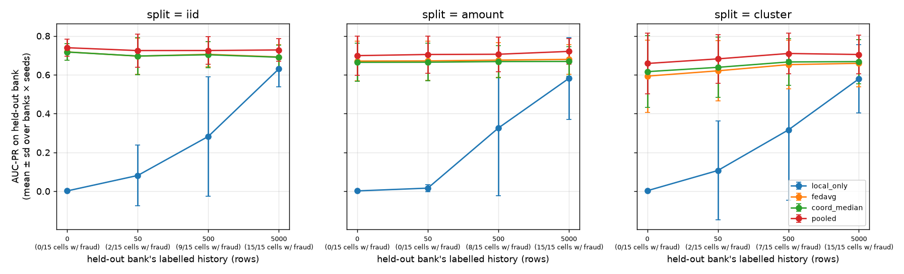
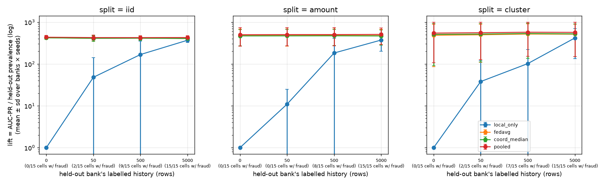
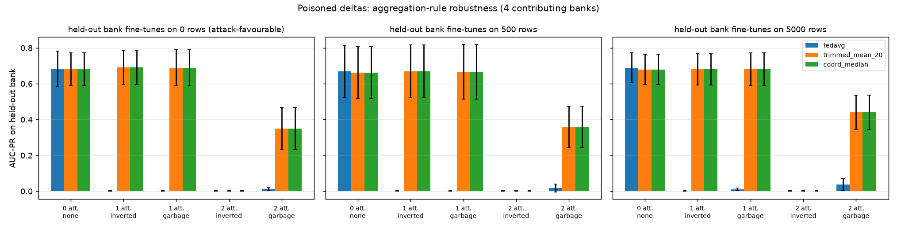

# Kavach v2 — Federated Cold-Start Experiment

## What this is and is not

**Is:** a test of the *mechanism* in Component B — whether aggregating weight deltas from several
partitions transfers useful structure to a partition that contributed nothing, how fast local
history closes the gap, and (Result 3) whether per-bank calibrated cutoffs do anything a single
global cutoff does not. Run on the ULB credit-card dataset (284,807 rows, fraud prevalence
0.173%), partitioned into 5 synthetic "banks".

**Is not:** evidence about Indian UPI/IMPS fraud. The data is 2013 European card fraud with
anonymised PCA features; the "banks" are partitions, not institutions; the feature spec is
`ulb_creditcard_eval@v1[29]` (evaluation only), not the production `FEATURE_CONTRACT`. Read every number below
as a property of the federated-learning machinery, not of Kavach's fraud detection.

## Protocol

- **Learner:** online logistic regression (numpy SGD), fixed transforms only, `pos_weight=50.0`,
  `lr=0.05`, `l2=0.0001`, batch 256. Identical for every method.
- **Federation:** 5 rounds; each contributing bank trains 1 local epoch(s) from the
  current global model and sends only `weights_after − weights_before` with its row count. Aggregated by
  FedAvg (sample-weighted mean) or coordinate-median. Delta norms clipped at 50 in both cases.
- **Held-out bank:** every bank in turn. Its rows are permuted once per seed; the first *n* form its
  labelled history (n ∈ [0, 50, 500, 5000]), rows beyond position 5000 form a **fixed test set** so
  all history sizes are scored on identical rows.
- **Methods compared on the held-out bank**, each followed by the *same* 10-epoch fine-tune on the *n* history rows:
  - `local_only` — from zero weights. **Degenerate whenever its history contains no fraud row**: with no positive
    example it cannot learn a ranking direction. At n=0 that is every cell; at n=50 it is almost every cell (see the
    "cells with ≥1 fraud" column). Comparisons in those cells are against a model that cannot do the task.
  - `fedavg` — FedAvg global model learned from the other 4 banks' deltas.
  - `coord_median` — same, coordinate-median aggregation.
  - `pooled` — the other banks' raw rows pooled centrally, 5 epochs. **Upper bound**: what federation
    is trying to approach without anyone pooling data.
- **Seeds:** [0, 1, 2] → 15 (seed × held-out bank) cells per split per history size.
- **Metrics:** AUC-PR on the held-out bank's test rows, **and lift = AUC-PR / that cell's own prevalence.**
  AUC-PR's floor is the prevalence, and held-out prevalence varies several-fold across banks under the non-IID
  splits, so a raw cross-bank mean mixes scales and its sd includes base-rate variation. Lift puts every cell on
  its own floor. Paired win counts are identical under both metrics (same test set per cell); lift changes the
  cross-bank mean and spread. Spread is the sd over cells.

## Splits

### `iid`

IID control: each row assigned to a bank uniformly at random.

| Bank | Rows | Fraud | Prevalence | Median amount (EUR) |
|---|---|---|---|---|
| bank0 | 56,933 | 105 | 0.184% | 22.10 |
| bank1 | 56,757 | 107 | 0.189% | 21.99 |
| bank2 | 57,050 | 104 | 0.182% | 21.84 |
| bank3 | 57,133 | 97 | 0.170% | 21.95 |
| bank4 | 56,934 | 79 | 0.139% | 22.36 |

Prevalence ratio across banks (max/min): **1.4×** (seed 0).

### `amount`

Amount skew: rows binned into 5 amount-quantile bands; a row in band k goes to bank k with p=0.7 and to each other bank with p=0.075. Banks therefore differ in transaction-size distribution AND fraud prevalence.

| Bank | Rows | Fraud | Prevalence | Median amount (EUR) |
|---|---|---|---|---|
| bank0 | 56,836 | 178 | 0.313% | 1.98 |
| bank1 | 57,292 | 60 | 0.105% | 9.83 |
| bank2 | 57,129 | 55 | 0.096% | 22.00 |
| bank3 | 56,591 | 88 | 0.156% | 52.90 |
| bank4 | 56,959 | 111 | 0.195% | 146.48 |

Prevalence ratio across banks (max/min): **3.3×** (seed 0).

### `cluster`

Feature-cluster skew: k-means (k=5) on V1..V5, the five highest-variance PCA components; a row in cluster k goes to bank k with p=0.7, else uniformly elsewhere. Banks occupy different regions of feature space.

| Bank | Rows | Fraud | Prevalence | Median amount (EUR) |
|---|---|---|---|---|
| bank0 | 85,722 | 66 | 0.077% | 29.42 |
| bank1 | 62,653 | 140 | 0.223% | 20.24 |
| bank2 | 23,477 | 43 | 0.183% | 27.90 |
| bank3 | 88,090 | 56 | 0.064% | 17.68 |
| bank4 | 24,865 | 187 | 0.752% | 19.95 |

Prevalence ratio across banks (max/min): **11.8×** (seed 0).

## Result 1 — cold start

Raw AUC-PR (left figure) and lift over each cell's prevalence floor (right figure, log scale). X-axis labels show how many of the cells had at least one fraud row in the held-out bank's history.

### `iid` — held-out bank, mean ± sd over 15 cells; each cell shows AUC-PR and lift

| History rows | cells with ≥1 fraud in history | fraud rows in history min/mean/max | `local_only` | `fedavg` | `coord_median` | `pooled` | fedavg beats local (cells) | pooled − fedavg (AUC-PR) |
|---|---|---|---|---|---|---|---|---|
| **5000** | 15/15 | 6/9.4/14 | 0.631 ± 0.092 lift 369 ± 43 | 0.692 ± 0.062 lift 406 ± 43 | 0.691 ± 0.062 lift 405 ± 42 | 0.728 ± 0.057 lift 428 ± 44 | 14/15 | +0.036 |
| 500 | 9/15 | 0/0.9/3 | 0.283 ± 0.308 lift 168 ± 186 | 0.705 ± 0.065 lift 414 ± 46 | 0.703 ± 0.067 lift 413 ± 46 | 0.725 ± 0.070 lift 426 ± 48 | 15/15 | +0.020 |
| 50 | 2/15 | 0/0.1/1 | 0.081 ± 0.157 lift 48 ± 94 | 0.696 ± 0.093 lift 410 ± 64 | 0.697 ± 0.096 lift 410 ± 65 | 0.725 ± 0.085 lift 426 ± 61 | 15/15 | +0.029 |
| 0 — *degenerate* | 0/15 | 0/0.0/0 | 0.002 ± 0.000 lift 1 ± 0 | 0.718 ± 0.043 lift 422 ± 40 | 0.717 ± 0.043 lift 422 ± 40 | 0.740 ± 0.045 lift 435 ± 43 | 15/15 | +0.022 |

### `amount` — held-out bank, mean ± sd over 15 cells; each cell shows AUC-PR and lift

| History rows | cells with ≥1 fraud in history | fraud rows in history min/mean/max | `local_only` | `fedavg` | `coord_median` | `pooled` | fedavg beats local (cells) | pooled − fedavg (AUC-PR) |
|---|---|---|---|---|---|---|---|---|
| **5000** | 15/15 | 2/10.1/21 | 0.581 ± 0.211 lift 372 ± 171 | 0.679 ± 0.076 lift 475 ± 193 | 0.669 ± 0.076 lift 466 ± 186 | 0.721 ± 0.066 lift 508 ± 215 | 10/15 | +0.041 |
| 500 | 8/15 | 0/1.1/5 | 0.326 ± 0.348 lift 183 ± 222 | 0.676 ± 0.090 lift 478 ± 208 | 0.668 ± 0.083 lift 470 ± 195 | 0.706 ± 0.089 lift 503 ± 230 | 13/15 | +0.030 |
| 50 | 0/15 | 0/0.0/0 | 0.016 ± 0.018 lift 11 ± 14 | 0.672 ± 0.101 lift 476 ± 209 | 0.665 ± 0.097 lift 469 ± 199 | 0.705 ± 0.096 lift 502 ± 231 | 15/15 | +0.033 |
| 0 — *degenerate* | 0/15 | 0/0.0/0 | 0.002 ± 0.001 lift 1 ± 0 | 0.671 ± 0.103 lift 475 ± 210 | 0.664 ± 0.098 lift 467 ± 196 | 0.699 ± 0.100 lift 499 ± 233 | 15/15 | +0.028 |

### `cluster` — held-out bank, mean ± sd over 15 cells; each cell shows AUC-PR and lift

| History rows | cells with ≥1 fraud in history | fraud rows in history min/mean/max | `local_only` | `fedavg` | `coord_median` | `pooled` | fedavg beats local (cells) | pooled − fedavg (AUC-PR) |
|---|---|---|---|---|---|---|---|---|
| **5000** | 15/15 | 1/13.1/47 | 0.579 ± 0.176 lift 417 ± 284 | 0.659 ± 0.121 lift 514 ± 365 | 0.668 ± 0.114 lift 524 ± 374 | 0.705 ± 0.100 lift 568 ± 417 | 14/15 | +0.046 |
| 500 | 7/15 | 0/1.6/9 | 0.316 ± 0.361 lift 102 ± 121 | 0.652 ± 0.125 lift 518 ± 382 | 0.666 ± 0.121 lift 533 ± 396 | 0.710 ± 0.105 lift 573 ± 421 | 12/15 | +0.057 |
| 50 | 2/15 | 0/0.1/1 | 0.107 ± 0.255 lift 38 ± 81 | 0.620 ± 0.154 lift 498 ± 388 | 0.638 ± 0.155 lift 518 ± 406 | 0.682 ± 0.125 lift 557 ± 430 | 14/15 | +0.062 |
| 0 — *degenerate* | 0/15 | 0/0.0/0 | 0.003 ± 0.003 lift 1 ± 0 | 0.593 ± 0.186 lift 484 ± 399 | 0.616 ± 0.185 lift 507 ± 417 | 0.658 ± 0.157 lift 546 ± 439 | 15/15 | +0.065 |

### Conditioning on whether local-only had a fraud row to learn from

The same cells, split by whether the held-out bank's *n*-row history contained at least one fraud row. Local-only cannot rank without one; federation does not need one. Means are AUC-PR over the cells in that condition.

#### `iid`

| History rows | condition | cells | `local_only` | `fedavg` | `coord_median` | `pooled` | fedavg beats local |
|---|---|---|---|---|---|---|---|
| 50 | ≥1 fraud row | 2 | 0.321 | 0.548 | 0.549 | 0.586 | 2/2 |
| 50 | no fraud row | 13 | 0.044 | 0.719 | 0.719 | 0.746 | 13/13 |
| 500 | ≥1 fraud row | 9 | 0.466 | 0.696 | 0.693 | 0.711 | 9/9 |
| 500 | no fraud row | 6 | 0.008 | 0.720 | 0.719 | 0.746 | 6/6 |
| 5000 | ≥1 fraud row | 15 | 0.631 | 0.692 | 0.691 | 0.728 | 14/15 |
| 5000 | no fraud row | 0 | — | — | — | — | — |

#### `amount`

| History rows | condition | cells | `local_only` | `fedavg` | `coord_median` | `pooled` | fedavg beats local |
|---|---|---|---|---|---|---|---|
| 50 | ≥1 fraud row | 0 | — | — | — | — | — |
| 50 | no fraud row | 15 | 0.016 | 0.672 | 0.665 | 0.705 | 15/15 |
| 500 | ≥1 fraud row | 8 | 0.598 | 0.693 | 0.683 | 0.727 | 6/8 |
| 500 | no fraud row | 7 | 0.014 | 0.656 | 0.651 | 0.682 | 7/7 |
| 5000 | ≥1 fraud row | 15 | 0.581 | 0.679 | 0.669 | 0.721 | 10/15 |
| 5000 | no fraud row | 0 | — | — | — | — | — |

#### `cluster`

| History rows | condition | cells | `local_only` | `fedavg` | `coord_median` | `pooled` | fedavg beats local |
|---|---|---|---|---|---|---|---|
| 50 | ≥1 fraud row | 2 | 0.727 | 0.724 | 0.720 | 0.745 | 1/2 |
| 50 | no fraud row | 13 | 0.011 | 0.605 | 0.626 | 0.672 | 13/13 |
| 500 | ≥1 fraud row | 7 | 0.664 | 0.703 | 0.704 | 0.740 | 4/7 |
| 500 | no fraud row | 8 | 0.011 | 0.608 | 0.633 | 0.683 | 8/8 |
| 5000 | ≥1 fraud row | 15 | 0.579 | 0.659 | 0.668 | 0.705 | 14/15 |
| 5000 | no fraud row | 0 | — | — | — | — | — |

### Reading Result 1

**The headline is n=5000, the only history size at which every cell's local model had fraud rows to learn from** (minimum 6 under `iid`, 2 under `amount`, 1 under `cluster`). There the baseline is genuinely trying and federation still wins:

- **`iid`, n=5000:** local-only 0.631 → FedAvg **0.692** (wins 14/15), coordinate-median 0.691 (wins 15/15); pooled upper bound 0.728. Federation closes 63% of the pooled-vs-local gap.
- **`amount`, n=5000:** local-only 0.581 → FedAvg **0.679** (wins 10/15), coordinate-median 0.669 (wins 9/15); pooled upper bound 0.721. Federation closes 70% of the pooled-vs-local gap.
- **`cluster`, n=5000:** local-only 0.579 → FedAvg **0.659** (wins 14/15), coordinate-median 0.668 (wins 15/15); pooled upper bound 0.705. Federation closes 64% of the pooled-vs-local gap.

**n=50 is near-degenerate and n=500 is mixed.** At n=50 only 2/0/2 of 15 cells (by split) had any fraud row in the history; at n=500, 9/8/7. In cells with **no** fraud row local-only sits near its prevalence floor and federation wins every cell — but that is the n=0 comparison again, not a new result. In the n=500 cells that **did** contain a fraud row, local-only jumps to 0.466, 0.598, 0.664 (by split) and federation's margin shrinks to +0.230 (9/9), +0.095 (6/8), +0.039 (4/7).

**What federation actually fixes here is positive-class scarcity, not sample scarcity.** A new bank has plenty of transactions and almost no confirmed fraud labels. One fraud row in the local history moves local-only from ≈0.01 to ≈0.5–0.7 AUC-PR; the other 499 legitimate rows barely matter. The federated baseline supplies the ranking direction that only positives can teach, from banks that have them. That is the mechanism, and it is a narrower claim than "federation beats local at cold start": at every history size where the local model has seen a handful of frauds, the advantage is real but modest (≈+0.06 to +0.10 AUC-PR at n=5000), and it would shrink further with a stronger local learner.

**Lift.** Per-cell win counts are the same under lift by construction (shared test set). The cross-bank means are what lift changes, and the federated-over-local ordering of means is preserved in every split and every history size.

### Per-held-out-bank breakdown (attributing the spread)

Mean over seeds for each held-out bank at n=500 and n=5000. `prev` is that bank's test-set prevalence — the AUC-PR floor for its row. Where AUC-PR tracks `prev` down a column, the cross-bank sd is base rate, not method.

#### `iid`

| Held-out | prev | `local_only` n=500 | `fedavg` n=500 | `coord_median` n=500 | `pooled` n=500 | `local_only` n=5000 | `fedavg` n=5000 | `coord_median` n=5000 | `pooled` n=5000 |
|---|---|---|---|---|---|---|---|---|---|
| bank0 | 0.171% | 0.220 119× | 0.686 404× | 0.683 401× | 0.714 419× | 0.618 364× | 0.656 386× | 0.658 387× | 0.698 409× |
| bank1 | 0.180% | 0.011 6× | 0.744 413× | 0.744 413× | 0.767 426× | 0.675 374× | 0.706 392× | 0.712 395× | 0.752 418× |
| bank2 | 0.175% | 0.594 348× | 0.749 437× | 0.750 437× | 0.787 460× | 0.666 382× | 0.762 443× | 0.753 438× | 0.801 467× |
| bank3 | 0.171% | 0.391 248× | 0.726 428× | 0.726 428× | 0.732 430× | 0.672 394× | 0.697 410× | 0.697 409× | 0.714 419× |
| bank4 | 0.160% | 0.197 118× | 0.621 390× | 0.613 384× | 0.626 393× | 0.521 329× | 0.636 400× | 0.633 398× | 0.675 426× |

Pearson r between a cell's AUC-PR and its prevalence at n=5000 (15 cells): fedavg **+0.49**, local-only +0.62, pooled +0.50. A weak r means the spread is mostly method/seed variance, not base rate.

#### `amount`

| Held-out | prev | `local_only` n=500 | `fedavg` n=500 | `coord_median` n=500 | `pooled` n=500 | `local_only` n=5000 | `fedavg` n=5000 | `coord_median` n=5000 | `pooled` n=5000 |
|---|---|---|---|---|---|---|---|---|---|
| bank0 | 0.303% | 0.714 236× | 0.778 257× | 0.769 254× | 0.799 264× | 0.711 235× | 0.758 251× | 0.753 249× | 0.785 259× |
| bank1 | 0.111% | 0.231 198× | 0.740 671× | 0.728 660× | 0.762 691× | 0.647 586× | 0.730 661× | 0.720 652× | 0.759 689× |
| bank2 | 0.091% | 0.213 238× | 0.657 725× | 0.628 693× | 0.739 815× | 0.230 252× | 0.640 707× | 0.617 682× | 0.718 793× |
| bank3 | 0.140% | 0.013 9× | 0.655 471× | 0.651 469× | 0.627 450× | 0.634 458× | 0.599 432× | 0.595 429× | 0.616 443× |
| bank4 | 0.206% | 0.456 232× | 0.548 266× | 0.564 274× | 0.603 293× | 0.685 333× | 0.670 325× | 0.659 320× | 0.725 353× |

Pearson r between a cell's AUC-PR and its prevalence at n=5000 (15 cells): fedavg **+0.48**, local-only +0.56, pooled +0.40. A weak r means the spread is mostly method/seed variance, not base rate.

#### `cluster`

| Held-out | prev | `local_only` n=500 | `fedavg` n=500 | `coord_median` n=500 | `pooled` n=500 | `local_only` n=5000 | `fedavg` n=5000 | `coord_median` n=5000 | `pooled` n=5000 |
|---|---|---|---|---|---|---|---|---|---|
| bank0 | 0.163% | 0.124 64× | 0.558 442× | 0.587 461× | 0.624 492× | 0.461 374× | 0.553 436× | 0.568 445× | 0.604 482× |
| bank1 | 0.116% | 0.171 90× | 0.615 763× | 0.638 793× | 0.673 836× | 0.518 627× | 0.604 764× | 0.627 792× | 0.670 844× |
| bank2 | 0.334% | 0.521 173× | 0.744 532× | 0.739 526× | 0.779 559× | 0.665 418× | 0.729 515× | 0.724 507× | 0.749 542× |
| bank3 | 0.113% | 0.009 12× | 0.583 686× | 0.616 729× | 0.695 806× | 0.493 503× | 0.615 677× | 0.630 699× | 0.692 786× |
| bank4 | 0.606% | 0.754 169× | 0.762 165× | 0.751 157× | 0.779 170× | 0.758 165× | 0.794 179× | 0.790 177× | 0.808 185× |

Pearson r between a cell's AUC-PR and its prevalence at n=5000 (15 cells): fedavg **+0.82**, local-only +0.81, pooled +0.78. A strong positive r means most of the raw sd in that column is base rate.

### FedAvg vs coordinate-median with no attacker

The efficiency price of the robust rule, if any (AUC-PR difference, median − fedavg; paired wins for median):

- `iid`: n=5000: -0.001 (6/15); n=500: -0.002 (4/15); n=50: +0.000 (7/15); n=0: -0.001 (7/15)
- `amount`: n=5000: -0.011 (1/15); n=500: -0.008 (3/15); n=50: -0.007 (2/15); n=0: -0.006 (2/15)
- `cluster`: n=5000: +0.009 (10/15); n=500: +0.014 (12/15); n=50: +0.018 (12/15); n=0: +0.023 (13/15)

A negative number is the cost of using the median when everyone is honest; a positive one means the median generalised *better* to the held-out bank — which happens when partitions are skewed enough that the sample-weighted mean is dominated by whichever contributor is largest or most atypical.

## Result 2 — poisoned deltas (§5.4)

Split `amount`, every bank held out in turn, seeds [0, 1, 2]. Of the 4 contributing banks, 0, 1 or 2 are
attackers. An attacker replaces its honest delta with either **inverted** (−10× the honest delta) or **garbage**
(N(0, 5²) noise), and **claims 20× its true sample count** to dominate a weighted average. Delta norm clipping (50)
applies to all rules. After aggregation the held-out bank fine-tunes the (possibly poisoned) global model on
0, 500, 5000 rows of its own history and is scored on its fixed test set.

**Which setting is realistic.** n=0 is the setting most favourable to the attack: the poisoned global model is all
the bank has. It is the brand-new-bank case and it is where the damage is largest. n=500 / n=5000 is the operating
case for a bank that has been live for a while; the question there is how much of the poison local fine-tuning
recovers — and, given Result 1, recovery depends on whether the local history contains fraud rows.

| Attackers | Attack | `fedavg` n=0 | `coord_median` n=0 | `fedavg` n=500 | `coord_median` n=500 | `fedavg` n=5000 | `coord_median` n=5000 |
|---|---|---|---|---|---|---|---|
| 0 | none | 0.682 ± 0.100 | 0.682 ± 0.091 | 0.668 ± 0.145 | 0.661 ± 0.144 | 0.688 ± 0.083 | 0.680 ± 0.084 |
| 1 | inverted | 0.001 ± 0.001 | 0.691 ± 0.095 | 0.001 ± 0.001 | 0.670 ± 0.147 | 0.001 ± 0.001 | 0.680 ± 0.086 |
| 1 | garbage | 0.003 ± 0.002 | 0.689 ± 0.100 | 0.003 ± 0.002 | 0.666 ± 0.153 | 0.010 ± 0.008 | 0.681 ± 0.090 |
| 2 | inverted | 0.001 ± 0.001 | 0.001 ± 0.001 | 0.001 ± 0.001 | 0.001 ± 0.001 | 0.001 ± 0.001 | 0.001 ± 0.001 |
| 2 | garbage | 0.012 ± 0.009 | 0.349 ± 0.117 | 0.018 ± 0.022 | 0.359 ± 0.115 | 0.039 ± 0.032 | 0.441 ± 0.096 |

- **n=0** (mean 0.0 fraud rows in history): clean FedAvg 0.682; one inverted attacker -> FedAvg **0.001**, coordinate-median **0.691**; two garbage attackers -> FedAvg 0.012, coordinate-median 0.349.
- **n=500** (mean 0.7 fraud rows in history): clean FedAvg 0.668; one inverted attacker -> FedAvg **0.001**, coordinate-median **0.670**; two garbage attackers -> FedAvg 0.018, coordinate-median 0.359. Relative to n=0, local fine-tuning recovers **0%** of FedAvg's loss under one inverted attacker and 1% under two garbage attackers.
- **n=5000** (mean 9.1 fraud rows in history): clean FedAvg 0.688; one inverted attacker -> FedAvg **0.001**, coordinate-median **0.680**; two garbage attackers -> FedAvg 0.039, coordinate-median 0.441. Relative to n=0, local fine-tuning recovers **0%** of FedAvg's loss under one inverted attacker and 4% under two garbage attackers.

**Reading.** The realistic operating case is no more forgiving than the attack-favourable one. Under the same
10-epoch fine-tune budget used everywhere in Result 1, a held-out bank with thousands of rows and ~10 fraud
labels does not pull a FedAvg model back from a single inverted attacker: the poisoned weights sit far from the origin
and SGD at this budget does not return them. Coordinate-median is the defence at every history size, not just at
cold start. The design implication is Section 5.5's: a bank should score the incoming global model on its own labelled
history *before* adopting it and fall back to its last good model (or to human review) when that score collapses -
detection, not recovery, is what local data buys against a poisoned aggregate.

`trimmed_mean_20` equals `coord_median` here (20% trimming of 4 participants removes 0 per side and falls back to the median);
it is in the figure and the JSON but omitted from the table.

Coordinate-median tolerates strictly fewer than half of the participants being malicious. With 4 contributors that
means **1 attacker is inside its breakdown point and 2 is at it** — the 2-attacker rows are expected to show degradation for
*every* rule, and they are reported because they are the honest edge of the guarantee.

## Result 3 — threshold bridge: per-bank calibrated cutoffs vs one global cutoff

This is the mechanism the brief actually promises for Component B (§2.3). One FedAvg global model
is trained over all 5 banks per (split, seed); each bank's rows are split into a *fit* third, a *calibration*
third and an *evaluation* third, and every strategy is scored on the same evaluation third.

**Scope — read before the tables.** Four of the five rows use that single global model as the scorer at every bank,
so that **only the cutoffs differ** between conditions. That isolates the cutoff effect, but it means those rows test
*per-bank cutoffs*, not the brief's full "global baseline + local fine-tuning + per-bank cutoff" stack (§2.2). The
fifth row, `fullstack_flagrate`, adds the missing piece: each bank fine-tunes the global model on its fit third, then
calibrates per-bank flag-rate cutoffs with its own fine-tuned model. Where the full stack differs from
`perbank_flagrate`, the difference is the local fine-tuning, not the cutoffs.

- **Flag-rate targets** (unlabelled, day-one): ≥L1 5%, ≥L2 1%, ≥L3 0.1% of traffic.
  `global_flagrate` = one cutoff set from pooled calibration scores (the v1 "single number" analogue);
  `perbank_flagrate` = each bank's own; `fullstack_flagrate` = each bank's own, with its fine-tuned model.
- **Precision targets** (labelled, after `/feedback`): ≥L1 2%, ≥L2 10%, ≥L3 50%.
  `global_precision` from pooled labelled calibration data; `perbank_precision` from each bank's own.

Cells: 5 banks × 3 seeds = 15 per split. Fraud counts per bank-third are small
(tens), so ≥L3 precision/recall are noisy; read ≥L2 as the main operating point.

### `iid`

**Alert volume per bank at ≥L2 (target 1.00% of each bank's traffic)** — mean over seeds:

| Bank | eval prevalence | `global_flagrate` flag rate | `perbank_flagrate` flag rate | `fullstack_flagrate` flag rate | global recall | per-bank recall | full-stack recall | global precision | per-bank precision | full-stack precision |
|---|---|---|---|---|---|---|---|---|---|---|
| bank0 | 0.172% | 1.05% | 1.13% | 1.05% | 82.2% | 82.2% | 80.5% | 13.5% | 12.5% | 13.2% |
| bank1 | 0.174% | 0.98% | 0.94% | 0.95% | 91.6% | 91.6% | 91.6% | 16.5% | 17.2% | 16.9% |
| bank2 | 0.137% | 1.00% | 1.03% | 1.04% | 91.3% | 91.3% | 91.3% | 12.5% | 12.1% | 12.0% |
| bank3 | 0.199% | 0.99% | 0.91% | 0.96% | 86.8% | 86.8% | 86.0% | 17.3% | 19.0% | 17.8% |
| bank4 | 0.170% | 0.97% | 0.97% | 0.95% | 77.2% | 77.2% | 73.7% | 13.4% | 13.3% | 13.1% |

Across bank-cells the ≥L2 alert volume under the global cutoff ranges **0.89%–1.19%** (sd 0.08%) against a 1.00% budget; under per-bank calibration it ranges **0.82%–1.26%** (sd 0.13%). The per-bank residual is calibration-vs-evaluation sampling noise; the global spread is the distribution shift between banks.

**Totals over all banks, per level (same model, same overall alert budget):**

| Level | Strategy | total alerts / seed | total TP / seed | pooled precision | pooled recall |
|---|---|---|---|---|---|
| ≥L1 | `global_flagrate` | 4,769 | 142.7 | 3.0% | 88.3% |
| ≥L1 | `perbank_flagrate` | 4,793 | 143.3 | 3.0% | 88.7% |
| ≥L1 | `fullstack_flagrate` | 4,723 | 141.7 | 3.0% | 87.7% |
| ≥L2 | `global_flagrate` | 947 | 138.3 | 14.6% | 85.6% |
| ≥L2 | `perbank_flagrate` | 947 | 138.3 | 14.6% | 85.6% |
| ≥L2 | `fullstack_flagrate` | 939 | 136.0 | 14.6% | 84.2% |
| ≥L3 | `global_flagrate` | 91 | 75.7 | 83.4% | 46.8% |
| ≥L3 | `perbank_flagrate` | 91 | 75.3 | 83.1% | 46.6% |
| ≥L3 | `fullstack_flagrate` | 91 | 74.3 | 81.2% | 46.0% |

**Precision targets — achieved ≥L2 precision per bank (target 10%), mean over seeds:**

| Bank | `global_precision` precision | `perbank_precision` precision | global recall | per-bank recall | global alerts | per-bank alerts |
|---|---|---|---|---|---|---|
| bank0 | 8.7% | 8.1% | 82.2% | 82.2% | 308 | 334 |
| bank1 | 10.8% | 10.4% | 91.6% | 91.6% | 283 | 295 |
| bank2 | 8.0% | 9.2% | 91.3% | 91.3% | 296 | 259 |
| bank3 | 11.6% | 12.0% | 86.8% | 86.8% | 281 | 274 |
| bank4 | 8.9% | 9.4% | 78.3% | 77.2% | 281 | 271 |

Bank-cells meeting the ≥L2 precision target on their evaluation half: global cutoff **7/15**, per-bank cutoff **8/15**.

**How different are the per-bank cutoffs?** (probability cutoff for ≥L2, mean over seeds; global cutoff for reference)

| | bank0 | bank1 | bank2 | bank3 | bank4 | global | max/min ratio |
|---|---|---|---|---|---|---|---|
| `perbank_flagrate` | 0.2755 | 0.2923 | 0.2845 | 0.2981 | 0.2869 | 0.2871 | 1.1× |
| `fullstack_flagrate` | 0.3202 | 0.3845 | 0.2973 | 0.2189 | 0.2657 | 0.2871 | 1.8× |
| `perbank_precision` | 0.2243 | 0.2286 | 0.2518 | 0.2386 | 0.2372 | 0.2345 | 1.1× |

### `amount`

**Alert volume per bank at ≥L2 (target 1.00% of each bank's traffic)** — mean over seeds:

| Bank | eval prevalence | `global_flagrate` flag rate | `perbank_flagrate` flag rate | `fullstack_flagrate` flag rate | global recall | per-bank recall | full-stack recall | global precision | per-bank precision | full-stack precision |
|---|---|---|---|---|---|---|---|---|---|---|
| bank0 | 0.308% | 3.01% | 1.02% | 1.01% | 88.6% | 86.3% | 84.5% | 9.0% | 26.1% | 25.8% |
| bank1 | 0.126% | 0.53% | 1.03% | 1.05% | 87.9% | 89.3% | 88.8% | 21.0% | 11.0% | 10.9% |
| bank2 | 0.098% | 0.43% | 0.95% | 0.88% | 83.7% | 83.7% | 83.7% | 19.3% | 8.7% | 9.3% |
| bank3 | 0.159% | 0.52% | 1.05% | 1.02% | 93.1% | 94.3% | 95.4% | 28.4% | 14.4% | 14.9% |
| bank4 | 0.198% | 0.67% | 1.06% | 1.11% | 76.9% | 76.9% | 76.9% | 22.7% | 14.4% | 13.7% |

Across bank-cells the ≥L2 alert volume under the global cutoff ranges **0.37%–3.11%** (sd 1.03%) against a 1.00% budget; under per-bank calibration it ranges **0.86%–1.14%** (sd 0.09%). The per-bank residual is calibration-vs-evaluation sampling noise; the global spread is the distribution shift between banks.

**Totals over all banks, per level (same model, same overall alert budget):**

| Level | Strategy | total alerts / seed | total TP / seed | pooled precision | pooled recall |
|---|---|---|---|---|---|
| ≥L1 | `global_flagrate` | 4,705 | 151.0 | 3.2% | 89.5% |
| ≥L1 | `perbank_flagrate` | 4,758 | 150.0 | 3.2% | 89.0% |
| ≥L1 | `fullstack_flagrate` | 4,738 | 148.7 | 3.1% | 88.1% |
| ≥L2 | `global_flagrate` | 979 | 145.3 | 14.8% | 86.1% |
| ≥L2 | `perbank_flagrate` | 968 | 144.7 | 14.9% | 85.7% |
| ≥L2 | `fullstack_flagrate` | 964 | 144.0 | 14.9% | 85.3% |
| ≥L3 | `global_flagrate` | 94 | 78.0 | 82.8% | 46.3% |
| ≥L3 | `perbank_flagrate` | 98 | 78.3 | 79.2% | 46.4% |
| ≥L3 | `fullstack_flagrate` | 100 | 78.0 | 78.2% | 46.3% |

**Precision targets — achieved ≥L2 precision per bank (target 10%), mean over seeds:**

| Bank | `global_precision` precision | `perbank_precision` precision | global recall | per-bank recall | global alerts | per-bank alerts |
|---|---|---|---|---|---|---|
| bank0 | 5.9% | 9.8% | 91.0% | 88.6% | 902 | 529 |
| bank1 | 13.9% | 13.2% | 87.9% | 89.3% | 153 | 167 |
| bank2 | 12.8% | 9.8% | 83.7% | 83.7% | 122 | 180 |
| bank3 | 21.0% | 12.6% | 94.3% | 94.3% | 135 | 227 |
| bank4 | 16.8% | 8.2% | 76.9% | 77.8% | 172 | 364 |

Bank-cells meeting the ≥L2 precision target on their evaluation half: global cutoff **12/15**, per-bank cutoff **10/15**.

**How different are the per-bank cutoffs?** (probability cutoff for ≥L2, mean over seeds; global cutoff for reference)

| | bank0 | bank1 | bank2 | bank3 | bank4 | global | max/min ratio |
|---|---|---|---|---|---|---|---|
| `perbank_flagrate` | 0.5013 | 0.2302 | 0.2051 | 0.2034 | 0.2320 | 0.3498 | 2.5× |
| `fullstack_flagrate` | 0.3025 | 0.3066 | 0.2084 | 0.2152 | 0.3994 | 0.3498 | 1.9× |
| `perbank_precision` | 0.3592 | 0.2607 | 0.2089 | 0.1834 | 0.1371 | 0.2730 | 2.6× |

### `cluster`

**Alert volume per bank at ≥L2 (target 1.00% of each bank's traffic)** — mean over seeds:

| Bank | eval prevalence | `global_flagrate` flag rate | `perbank_flagrate` flag rate | `fullstack_flagrate` flag rate | global recall | per-bank recall | full-stack recall | global precision | per-bank precision | full-stack precision |
|---|---|---|---|---|---|---|---|---|---|---|
| bank0 | 0.085% | 1.17% | 0.92% | 1.01% | 75.5% | 77.3% | 79.2% | 8.2% | 7.0% | 6.5% |
| bank1 | 0.158% | 1.14% | 1.07% | 1.05% | 69.9% | 73.4% | 73.3% | 9.9% | 11.4% | 11.5% |
| bank2 | 0.660% | 2.22% | 1.03% | 1.04% | 94.1% | 90.1% | 92.8% | 31.4% | 58.2% | 58.5% |
| bank3 | 0.066% | 0.45% | 0.94% | 0.93% | 68.1% | 70.4% | 69.2% | 10.7% | 4.9% | 4.8% |
| bank4 | 0.421% | 1.88% | 1.00% | 1.05% | 88.4% | 84.7% | 85.7% | 20.2% | 37.6% | 35.3% |

Across bank-cells the ≥L2 alert volume under the global cutoff ranges **0.33%–2.64%** (sd 0.83%) against a 1.00% budget; under per-bank calibration it ranges **0.85%–1.17%** (sd 0.09%). The per-bank residual is calibration-vs-evaluation sampling noise; the global spread is the distribution shift between banks.

**Totals over all banks, per level (same model, same overall alert budget):**

| Level | Strategy | total alerts / seed | total TP / seed | pooled precision | pooled recall |
|---|---|---|---|---|---|
| ≥L1 | `global_flagrate` | 4,756 | 149.3 | 3.1% | 89.6% |
| ≥L1 | `perbank_flagrate` | 4,755 | 149.3 | 3.1% | 89.6% |
| ≥L1 | `fullstack_flagrate` | 4,707 | 148.3 | 3.1% | 89.0% |
| ≥L2 | `global_flagrate` | 934 | 142.3 | 15.3% | 85.4% |
| ≥L2 | `perbank_flagrate` | 932 | 139.3 | 14.9% | 83.5% |
| ≥L2 | `fullstack_flagrate` | 949 | 142.3 | 15.0% | 85.4% |
| ≥L3 | `global_flagrate` | 86 | 65.3 | 75.5% | 39.1% |
| ≥L3 | `perbank_flagrate` | 103 | 59.3 | 57.8% | 35.6% |
| ≥L3 | `fullstack_flagrate` | 93 | 53.3 | 57.2% | 32.1% |

**Precision targets — achieved ≥L2 precision per bank (target 10%), mean over seeds:**

| Bank | `global_precision` precision | `perbank_precision` precision | global recall | per-bank recall | global alerts | per-bank alerts |
|---|---|---|---|---|---|---|
| bank0 | 5.2% | 9.6% | 77.3% | 75.5% | 255 | 123 |
| bank1 | 6.5% | 8.4% | 72.6% | 70.8% | 379 | 288 |
| bank2 | 24.9% | 9.6% | 94.1% | 94.5% | 226 | 483 |
| bank3 | 5.6% | 11.2% | 69.2% | 69.2% | 265 | 145 |
| bank4 | 15.2% | 8.6% | 88.4% | 88.4% | 324 | 425 |

Bank-cells meeting the ≥L2 precision target on their evaluation half: global cutoff **3/15**, per-bank cutoff **7/15**.

**How different are the per-bank cutoffs?** (probability cutoff for ≥L2, mean over seeds; global cutoff for reference)

| | bank0 | bank1 | bank2 | bank3 | bank4 | global | max/min ratio |
|---|---|---|---|---|---|---|---|
| `perbank_flagrate` | 0.4497 | 0.3179 | 0.9244 | 0.2428 | 0.7058 | 0.3183 | 3.8× |
| `fullstack_flagrate` | 0.1765 | 0.2806 | 0.6310 | 0.1446 | 0.3611 | 0.3183 | 4.4× |
| `perbank_precision` | 0.4142 | 0.2948 | 0.2106 | 0.3212 | 0.2229 | 0.2527 | 2.0× |

### Reading Result 3

- **`iid`:** per-bank >=L2 cutoffs differ by **1.1x** across banks. A single global cutoff sends **0.89%-1.19%** of each bank's traffic to review against a 1% budget; per-bank calibration holds it at **0.82%-1.26%**. For the same total alert volume, pooled >=L2 recall changes by **+0.0 pts** (per-bank minus global). Labelled precision-target calibration meets its >=L2 target in 7/15 bank-cells with the global cutoff vs 8/15 per-bank.
  Full stack (`fullstack_flagrate`, global + local fine-tune + per-bank cutoff): alert volume **0.84%-1.26%**, pooled >=L2 recall 84.2% vs 85.6% for per-bank cutoffs on the shared model and 85.6% for the global cutoff.
- **`amount`:** per-bank >=L2 cutoffs differ by **2.5x** across banks. A single global cutoff sends **0.37%-3.11%** of each bank's traffic to review against a 1% budget; per-bank calibration holds it at **0.86%-1.14%**. For the same total alert volume, pooled >=L2 recall changes by **-0.4 pts** (per-bank minus global). Labelled precision-target calibration meets its >=L2 target in 12/15 bank-cells with the global cutoff vs 10/15 per-bank.
  Full stack (`fullstack_flagrate`, global + local fine-tune + per-bank cutoff): alert volume **0.79%-1.23%**, pooled >=L2 recall 85.3% vs 85.7% for per-bank cutoffs on the shared model and 86.1% for the global cutoff.
- **`cluster`:** per-bank >=L2 cutoffs differ by **3.8x** across banks. A single global cutoff sends **0.33%-2.64%** of each bank's traffic to review against a 1% budget; per-bank calibration holds it at **0.85%-1.17%**. For the same total alert volume, pooled >=L2 recall changes by **-1.9 pts** (per-bank minus global). Labelled precision-target calibration meets its >=L2 target in 3/15 bank-cells with the global cutoff vs 7/15 per-bank.
  Full stack (`fullstack_flagrate`, global + local fine-tune + per-bank cutoff): alert volume **0.85%-1.19%**, pooled >=L2 recall 85.4% vs 83.5% for per-bank cutoffs on the shared model and 85.4% for the global cutoff.

**What the bridge demonstrably buys, on this data:** *alert-budget adherence per bank.* Under the non-IID splits a
single cutoff over-alerts the bank whose score distribution sits highest and starves the others - a 1% budget becomes
several percent at one bank and a fraction of a percent at another. Per-bank flag-rate calibration removes that, with no
labels needed.

**What it does not buy here:** *more fraud caught.* For the same total number of alerts, pooled >=L2 recall under per-bank
budgets minus recall under the global cutoff is +0.0 pts (`iid`), -0.4 pts (`amount`), -1.9 pts (`cluster`). Per-bank budgets
never gain more than +0.0 pts and give up 1.9 pts under `cluster`. That is expected from the construction: the global model's
probabilities are comparable across banks, so a single cutoff already allocates alerts to the highest-scoring rows regardless
of bank - the recall-optimal allocation of a fixed total budget. Per-bank budgets trade some of that optimality for predictable
ops load at every bank. Which one a federation wants is a policy decision, not a modelling one, and the bridge supports both.

**Labelled per-bank precision calibration is unreliable at this fraud volume.** Across all splits the >=L2 precision target
is met on the evaluation half in 22/45 bank-cells with the global cutoff and 25/45 with per-bank cutoffs, and
which strategy does better flips by split. With tens of confirmed frauds per bank-half, a cutoff fitted to one half does not
hold on the other whichever way it is fitted. Precision-target calibration should wait until `/feedback` has accumulated
hundreds of confirmed outcomes per bank; until then the bridge should run on flag-rate calibration. Under `iid` the flag-rate
strategies are, as expected, indistinguishable - that row is the control.

## Limitations

1. Card fraud, not UPI social engineering; PCA features, not Kavach's contract. Mechanism result only.
2. "Banks" are synthetic partitions of one dataset. Real banks differ in ways a mixing matrix does not capture
   (different fraud typologies, different labelling latency and quality, different base rates by an order of magnitude).
3. Logistic regression is a deliberately simple learner. The federated-vs-local *gap* at n=5000 (≈+0.06 to +0.10) is what is
   being claimed, and a stronger local learner would shrink it.
4. n=50 and most of n=500 compare against a local model with no positive examples; those cells restate the n=0 result and are
   labelled as such. The conditioned tables are the honest view of n=500.
5. Attackers here are crude (sign flip, noise, inflated counts). A stealthy attacker who shifts deltas by a small,
   consistent amount every round is not tested and is *not* defeated by a median.
6. No differential privacy or secure aggregation: the aggregator sees each bank's delta in the clear. "No raw data leaves
   the bank" is true; "nothing about the bank's data can be inferred from its delta" is not claimed.
7. Fine-tune epochs, rounds and learning rate were set once, not tuned per method. Tuning would move numbers, not the shape.
8. Result 3's scope is stated in its own section: most rows isolate the cutoff effect with one shared model; one row tests the
   full global + fine-tune + per-bank-cutoff stack.

_Run time 3.7 min. Raw trials in `cold_start_trials.json`._
